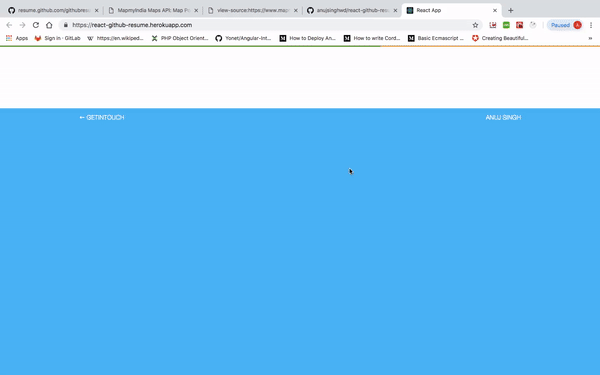

## React-Github-Resume Builder
  Build Resume Using Github Profile

## Preview
  

## To see how it's work

- Fork and star this repo**
- Clone this repo**
- git clone https://github.com/anujsinghwd/react-github-resume
- Run `npm install`
- Create a file `.env.development.local` and put your `github` Access Token in `REACT_APP_GITHUB_ACCESS_TOKEN`
- Run `npm start`

## Available Scripts

In the project directory, you can run:

### `npm start`

Runs the app in the development mode. 
Open [http://localhost:3000](http://localhost:3000) to view it in the browser.

The page will reload if you make edits. 
You will also see any lint errors in the console.

## Credits
* [javascript](https://developer.mozilla.org/bm/docs/Web/JavaScript)
* [ReactJS](https://github.com/facebook/react)
* [Create React App](https://github.com/facebook/create-react-app).
* [Github Apis](https://developer.github.com/v3/)
* [Bootstrap v4](https://getbootstrap.com/)

## Built With
* [javascript](https://developer.mozilla.org/bm/docs/Web/JavaScript)
* [ReactJS](https://github.com/facebook/react)
* [Create React App](https://github.com/facebook/create-react-app).
* [Github Apis](https://developer.github.com/v3/)
* [Bootstrap v4](https://getbootstrap.com/)

## Authors
* **Anuj Singh** - *Initial work* - [anujsinghwd](https://github.com/anujsinghwd)

## Contribution
Feel free to contribute
